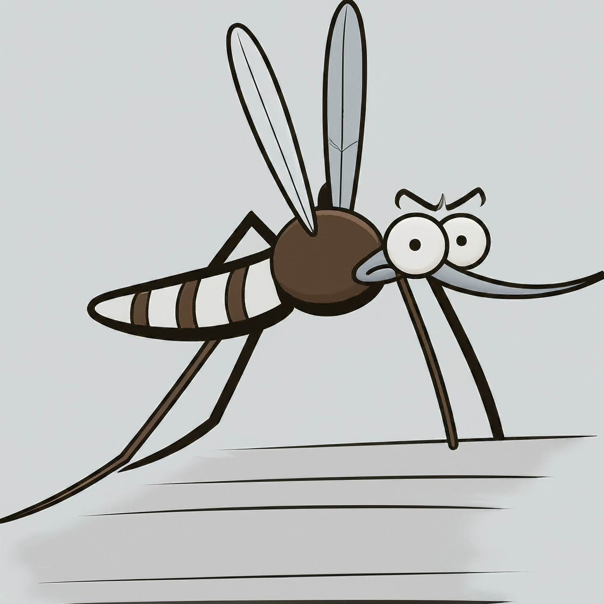

# 2025 Infodengue-Mosqlimate Dengue Forecast Modeling in Brazil

  

## Team: DS-OKSTATE
DS-OKSTATE conducts research aimed at understanding and mitigating Dengue Virus (DENV) epidemics in Brazil.

# Participants:
• Haridas K. Das, Oklahoma State University, Stillwater, USA

• Lucas M. Stolerman, Oklahoma State University, Stillwater, USA

## Methodology 

For the **2025 Dengue Forecast Sprint**, aimed at predictive modeling of dengue in Brazil, we will use the hybrid deep learning framework based on a **Convolutional Neural Network–Long Short-Term Memory (CNN-LSTM)** architecture. In the **2024 Infodengue Sprint**, we implemented the same hybrid CNN-LSTM model trained solely on epidemiological data for long-term forecasting, following the procedure described in Algorithm ~\ref{alg:hierarchical_training}.  

One key limitation identified in the existing literature is the lack of integration of climate data into long-term dengue forecasting models. To address this gap, our approach incorporates multivariate time series data that combines the **epidemiological week of dengue symptom onset** with relevant **climate-related variablesa**, enabling a more comprehensive and robust prediction framework.

## Convolutional Neural Network - Long Short-Term Memory (CNN-LSTM) model
In this hybrid model, the **CNN** component is responsible for extracting features from the input sequences. These extracted features are then passed to the **LSTM layers**, which are designed to capture long-term dependencies in dengue transmission patterns informed by the data (e.g. epidemiological and climatic data). In the 2024 Infodengue Sprint, we applied this model using only epidemiological data. For the 2025 Sprint, we aim to enhance the model by incorporating climate variables.

  

 

## Ensemble Modeling and Model Selection
To improve forecasting accuracy, we employ an ensemble of CNN-LSTM models trained with varying hyperparameters. The ensemble weights are derived from the inverse of each model’s Root Mean Squared Error (RMSE) on validation data, allowing better-performing models to contribute more to the final prediction. This approach reduces overfitting and increases robustness against noisy epidemiological and climate inputs.

## Incorporation of Climate Variables
Unlike many existing dengue forecasting efforts, our model explicitly integrates climate variables such as temperature, precipitation, humidity, and atmospheric pressure. These variables are known drivers of mosquito population dynamics and dengue transmission, providing additional predictive power when combined with epidemiological data.

## Expanding Window Training Strategy
Our hierarchical training algorithm uses an expanding window approach to sequentially update the model as new weekly data becomes available. This technique allows the model to adapt dynamically to evolving epidemic trends and improves long-term forecasting performance by continuously refining residuals from previous predictions.

## Data Sources and Preprocessing
We leverage multiple datasets, including epidemiological case counts from Infodengue, climate reanalysis data from ERA5 via Mosqlimate, and environmental and demographic data from IBGE and Embrapa. Data is aggregated by epidemiological week and municipality, with careful preprocessing to synchronize temporal and spatial resolutions for model input.

The raw data used in this repository is sourced from:

F. C. Coelho et al., Full dataset for dengue forecasting in Brazil for Infodengue-Mosqlimate sprint 2024, https://zenodo.org/records/13328231

## Goals 

The challenge had two test goals and a forecast goal, described below.

Validation test 1. Predict the weekly number of dengue cases by state (UF) in the 2022-2023 season [EW 41 2022- EW40 2023], using data covering the period from EW 01 2010 to EW 25 2022;

Validation test 2. Predict the weekly number of dengue cases by state (UF) in the 2023-2024 season [EW 41 2023- EW40 2024], using data covering the period from EW 01 2010 to EW 25 2023;

Validation test 3. Predict the weekly number of dengue cases in Brazil, and by state (UF), in the 2024-2025 season [EW 41 2024- EW40 2025], using data covering the period from EW 01 2010 to EW 25 2024;

Forecast target. Predict the weekly number of dengue cases in Brazil, and by state (UF), in the 2025-2026 season [EW 41 2025- EW40 2026], using data covering the period from EW 01 2010 to EW 25 2025;

## Forecast Evaluation and Validation
We used our model to generate dengue incidence forecasts for all 27 Brazilian federative units for the 2025–2026 season, covering Epidemiological Weeks (EW) 40 to 41, using only data up to EW 25 in that year. In other words, model training uses only data up to epidemiological week (EW) 25 of each target year, starting from EW 01, 2010, as input to generate forecasts from EW 41 of the target year through EW 40 of the following year, following the sprint’s guidelines. Model validation was rigorously performed through out-of-sample predictions for the 2022–2023, 2023–2024, and 2024–2025 seasons, producing dengue case curves by EW 41 to 40 with corresponding median and predictive intervals. Performance metrics—such as Root Mean Square Error (RMSE), Mean Absolute Error (MAE), and correlation with observed cases—were used to refine the model and optimize ensemble weighting. The forecasts include median estimates along with 50%, 80%, 90%, and 95% predictive intervals, as detailed below.  

## Prediction intervals 
After training the hierarchical expanding-window model at each level, we computed residuals from the previous training period, covering EW 01, 2010, to EW 25 of the target forecast year. We then estimated the standard deviation of these residuals and multiplied it by the standard normal z-scores corresponding to each desired coverage level (50%, 80%, 90%, and 95%) to obtain symmetric ranges around the forecasts. These ranges were added to and subtracted from the forecast values to form the upper and lower bounds of each interval. Finally, any negative lower bounds were set to zero to ensure all predicted case counts remained non-negative.

## Code organization
The GO_2025_IMDC_hybrid_CNN_LSTM_Cases_and_Climate_Data_Driven_Forecasting_Final_Submission.ipynb file contains the code used in this study and is located within the model folders. Moreover, the desired epidemiological weekly case data and climate data within the model folder are organized by state name (UF) for easy selection and use in the forecasting process.

## Reproducibility
To reproduce the results, use the code provided in the model folder. Then, select the state name (UF) corresponding to the desired epidemiological weekly case data and climate data. All the files and information to run the developed models are provided in this repository (https://github.com/haridas-das/DS_OKSTATE_2025).

## How to Cite This Repository
If you wish to cite this repository in a document, please use the following reference:

@misc{D-FENSE-GitHub,
   author       = {Das {H.K.}  Stolerman L. M.,
   title        = {{DS_OKSTATE_2025}: {D}engue {F}orecasting in {B}razil},
   year         = {2025},
   publisher    = {GitHub},
   journal      = {GitHub repository},
   howpublished = {https://github.com/haridas-das/DS_OKSTATE_2025},
}
